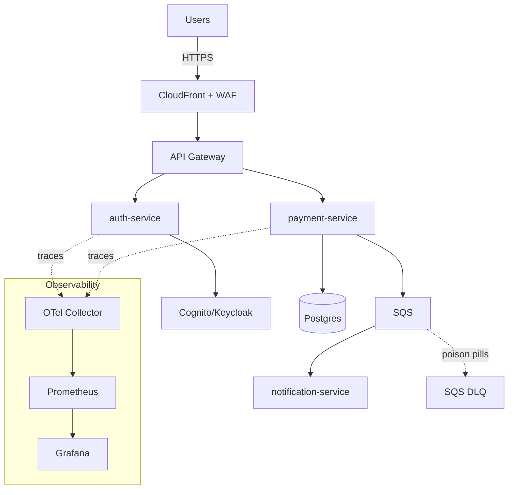
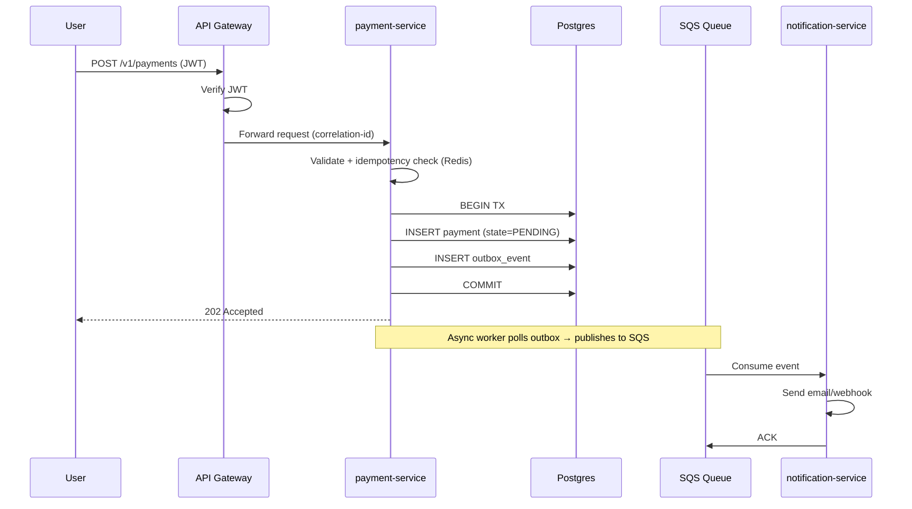

# 04 · Cloud Architecture Design

> **Objetivo:** documentar la arquitectura del sistema NexusCloud con el mismo rigor que exigiría un cliente enterprise: diagramas, decisiones justificadas, y alineación con AWS Well-Architected Framework.

---

## 🎯 1. System Overview

**NexusCloud** es una plataforma de procesamiento de pagos cloud-native diseñada para:

- Operar en AWS con arquitectura multi-región (documentada; simulada localmente con LocalStack + kind)
- Procesar transacciones de forma asíncrona con garantía at-least-once
- Recuperarse automáticamente ante fallos regionales (RTO < 3 min, RPO < 30 s)
- Ser observable de extremo a extremo (logs + metrics + traces correlated)
- Auto-triagear incidentes vía agente AI-Ops

**Business context (simulated):** procesador de pagos B2B con SLA 99.9%, tráfico esperado 1000 TPS peak, transacciones USD $50-$50,000, requisitos PCI-DSS (documentados aunque no implementados 100%).

---

## 🏛️ 2. High-Level Architecture (C4 Model — System Context)

### 2.1 Level 1 — System Context

```
                    ┌────────────────────────┐
                    │   NexusCloud Users     │
                    │  (Merchants / Clients) │
                    └───────────┬────────────┘
                                │ HTTPS
                                ▼
                    ┌────────────────────────┐
                    │    NexusCloud Platform │
                    │  (this system)         │
                    └────────┬──────┬────────┘
                             │      │
             ┌───────────────┘      └───────────────┐
             ▼                                      ▼
   ┌──────────────────┐                 ┌────────────────────┐
   │  Banking Network │                 │  Fraud Detection   │
   │  (external, mock)│                 │  Service (mock)    │
   └──────────────────┘                 └────────────────────┘
```

### 2.2 Level 2 — Container Diagram (main services)

```
                              [ Users ]
                                  │ HTTPS
                                  ▼
                    ┌──────────────────────────┐
                    │   CloudFront + WAF       │
                    │   (edge, local: nginx)   │
                    └────────────┬─────────────┘
                                 │
                    ┌────────────▼─────────────┐
                    │  API Gateway + Cognito   │
                    │  (local: FastAPI+Keycloak│
                    └────────────┬─────────────┘
                                 │
        ┌────────────────────────┼────────────────────────┐
        ▼                        ▼                        ▼
┌───────────────┐        ┌──────────────┐        ┌───────────────┐
│ auth-service  │        │payment-service│        │notification-  │
│ (Lambda /     │        │(FastAPI on   │        │service        │
│  container)   │        │ EKS/kind)    │        │(async worker) │
└───────┬───────┘        └──────┬───────┘        └───────┬───────┘
        │                       │                        │
        │                       │                        │
        ▼                       ▼                        ▼
┌───────────────┐        ┌──────────────┐        ┌───────────────┐
│ Keycloak /    │        │  PostgreSQL  │        │  SQS + DLQ    │
│ Cognito       │        │  (primary +  │        │               │
│               │        │   DR replica)│        │               │
└───────────────┘        └──────────────┘        └───────────────┘

                              [ Async event bus ]
                                     │
                     ┌───────────────┴────────────────┐
                     ▼                                ▼
              ┌─────────────┐                ┌────────────────┐
              │  S3 / MinIO │                │  ai-ops-agent  │
              │  (invoices) │                │  (Ollama LLM)  │
              └─────────────┘                └────────┬───────┘
                                                      │
                                                      ▼
                                              ┌───────────────┐
                                              │  Jira Cloud   │
                                              │  (real API)   │
                                              └───────────────┘

               [ Observability plane crosscutting ]
    ┌─────────────────────────────────────────────────────────┐
    │  OpenTelemetry Collector → Prometheus + Loki + Tempo →  │
    │                             Grafana                     │
    └─────────────────────────────────────────────────────────┘
```

### 2.3 Level 3 — Component (payment-service internal)

```
┌──────────────────────────── payment-service (FastAPI) ───────────────────────────┐
│                                                                                  │
│   ┌───────────────────┐    ┌──────────────────────┐    ┌──────────────────────┐  │
│   │ HTTP Router       │───▶│ Middleware Chain     │───▶│ Application Service  │  │
│   │ (FastAPI routes)  │    │ - Auth (JWT verify)  │    │ (use cases)          │  │
│   └───────────────────┘    │ - Rate limit (Redis) │    │ - process_payment    │  │
│                            │ - CorrelationID      │    │ - refund             │  │
│                            │ - OTel middleware    │    │ - query_status       │  │
│                            └──────────────────────┘    └─────────┬────────────┘  │
│                                                                  │               │
│                    ┌─────────────────────────────────────────────┼──────────┐    │
│                    ▼                                             ▼          ▼    │
│         ┌─────────────────────┐                    ┌─────────────────┐  ┌──────┐ │
│         │ Domain Layer        │                    │ Repository      │  │ MQ   │ │
│         │ - Payment entity    │                    │ (asyncpg)       │  │Client│ │
│         │ - Validation rules  │                    │ - save, load    │  │(SQS) │ │
│         └─────────────────────┘                    └────────┬────────┘  └──┬───┘ │
│                                                             │              │     │
└─────────────────────────────────────────────────────────────┼──────────────┼─────┘
                                                              ▼              ▼
                                                       ┌──────────┐   ┌──────────┐
                                                       │ Postgres │   │  SQS     │
                                                       └──────────┘   └──────────┘
```

---

## 🏛️ 3. AWS Well-Architected Framework — 6 Pillars Review

### 3.1 Operational Excellence

**Design principles applied:**
- Perform operations as code (**OpenTofu** for infra, **Helm** for apps)
- Make frequent, small, reversible changes (**GitOps via ArgoCD**)
- Anticipate failure (**chaos engineering**)
- Learn from operational events (**blameless post-mortems**)

**Evidence in project:**
- All infra in `/infra` as OpenTofu code, PR-reviewed
- Deployments via `git push` → ArgoCD sync (< 3 min)
- Runbooks in `/docs/runbooks/`
- Post-mortem template in `/docs/post-mortems/`

**Gaps documented (honesty):**
- No formal Game Day cadence beyond simulated
- No SLI-based automatic rollback

### 3.2 Security

**Design principles applied:**
- Implement a strong identity foundation (**IAM least privilege, IRSA**)
- Apply security at all layers (**defense in depth**)
- Automate security best practices (**shift-left in CI**)
- Protect data in transit and at rest (**TLS + KMS**)
- Prepare for security events (**incident response runbooks**)

**Evidence in project:**
- IAM roles per service with least privilege (documented policies)
- OIDC federation for CI (no long-lived credentials)
- Secrets in AWS Secrets Manager (local: LocalStack), never in env
- SAST (Bandit), IaC scan (Checkov, tfsec), container scan (Trivy) all fail-on-HIGH
- SBOM generation with syft, attached to releases
- Threat model documented in `docs/security-model.md` (STRIDE)

**Gaps documented:**
- No WAF rules for OWASP Top 10 in local (nginx-ingress basic ruleset only)
- No formal SOC 2 posture

### 3.3 Reliability

**Design principles applied:**
- Test recovery procedures (**DR runbook exercised**)
- Automatically recover from failure (**circuit breakers, retries**)
- Scale horizontally (**HPA on Kubernetes**)
- Stop guessing capacity (**Karpenter / EKS Auto Mode**)
- Manage change via automation (**GitOps + IaC**)

**Evidence in project:**
- RTO/RPO targets documented in `docs/slo-sli.md`
- DR runbook `docs/runbooks/dr-failover-playbook.md` cronometrado
- Circuit breakers via `tenacity` in payment-service
- Timeouts explicit on all HTTP clients (default 5s)
- Retry with exponential backoff on transient failures
- SQS DLQ for poison pills (maxReceiveCount=3)
- HPA on payment-service (CPU 70%, custom metric on queue depth)

**Reliability numbers targeted:**
| SLI | SLO |
|---|---|
| Availability | 99.9% (43 min downtime/month allowed) |
| P95 latency | < 300 ms |
| P99 latency | < 800 ms |
| Error rate | < 0.1% |
| DR RTO | < 3 min |
| DR RPO | < 30 s |

### 3.4 Performance Efficiency

**Design principles applied:**
- Democratize advanced technologies (**managed services**)
- Go global in minutes (**multi-region, CloudFront edge**)
- Use serverless architectures where fitting (**Lambda for auth**)
- Experiment more often (**local lab enables cheap testing**)
- Consider mechanical sympathy (**Graviton ARM for cost/perf**)

**Evidence in project:**
- Lambda for stateless auth ops (cold start acceptable at <100ms)
- FastAPI async I/O + connection pooling (asyncpg)
- Redis-based caching layer for JWT validation
- CDN (CloudFront documented, nginx-ingress local) for static assets
- Graviton (t4g.medium) instance families in OpenTofu configs

### 3.5 Cost Optimization

**Design principles applied:**
- Adopt a consumption model (**Aurora Serverless v2, Lambda**)
- Measure overall efficiency (**Infracost in PRs, KubeCost local**)
- Analyze and attribute expenditure (**tags: Environment, Owner, Project**)
- Use managed services (**RDS vs self-hosted Postgres**)

**Evidence in project:**
- Infracost comment on every PR
- Cost allocation tags enforced via tag policy in IaC
- Aurora Serverless v2 (scales to 0.5 ACU idle)
- Spot instances configuration documented for non-critical workloads
- FinOps runbook in `docs/runbooks/finops-review.md`

### 3.6 Sustainability

**Design principles applied:**
- Understand your impact (**AWS Customer Carbon Footprint Tool documented**)
- Establish sustainability goals (**Green Software Foundation metrics**)
- Maximize utilization (**Karpenter consolidation**)
- Use managed services (**less over-provisioning**)
- Reduce downstream impact (**efficient APIs, caching**)

**Evidence in project:**
- Carbon-aware region selection documented in ADR
- Graviton (ARM) instances (up to 60% less energy per compute unit)
- Right-sizing continuous via KubeCost

---

## 🎨 4. How to draw diagrams (deliverables)

### 4.1 Tools recommended (all free)

| Tool | Best for | URL |
|---|---|---|
| **Excalidraw** | Whiteboard-style, low-fi, quick | https://excalidraw.com |
| **draw.io / diagrams.net** | Full AWS icon library, exportable | https://app.diagrams.net |
| **Mermaid** | Diagram-as-code, embeddable in Markdown | Built into GitHub |
| **PlantUML** | UML diagrams as code | https://plantuml.com |
| **AWS Icons** | Official AWS shapes (import to draw.io) | AWS Architecture Icons |

### 4.2 Required diagrams for the portfolio

Ubicación: `/docs/architecture/diagrams/`

1. **`01-system-context.drawio`** — C4 Level 1
2. **`02-container-diagram.drawio`** — C4 Level 2
3. **`03-component-payment-service.drawio`** — C4 Level 3
4. **`04-network-topology.drawio`** — VPC, subnets, security groups
5. **`05-data-flow-payment.drawio`** — sequence: user → API → DB → SQS → worker
6. **`06-dr-failover.drawio`** — cross-region failover scenario
7. **`07-cicd-pipeline.drawio`** — GitHub Actions → OIDC → AWS → ArgoCD → EKS
8. **`08-threat-model.drawio`** — STRIDE overlays on data flow
9. **`09-observability-plane.drawio`** — OTel Collector → backends → Grafana

Export cada uno a PNG y embebe en el README / ADRs correspondientes.

### 4.3 Diagram-as-code example (Mermaid — para README)

Este renderiza directamente en GitHub:

````markdown

````

### 4.4 Sequence diagram (payment processing)

````markdown

````

---

## 🌐 5. Network topology

### 5.1 VPC design

```
VPC (10.0.0.0/16) — us-east-1
│
├── Public subnets (for ALB, NAT GW)
│   ├── 10.0.1.0/24  — AZ us-east-1a
│   ├── 10.0.2.0/24  — AZ us-east-1b
│   └── 10.0.3.0/24  — AZ us-east-1c
│
├── Private subnets (for EKS nodes, Lambdas in VPC)
│   ├── 10.0.11.0/24 — AZ us-east-1a
│   ├── 10.0.12.0/24 — AZ us-east-1b
│   └── 10.0.13.0/24 — AZ us-east-1c
│
└── Isolated subnets (for RDS, no internet egress)
    ├── 10.0.21.0/24 — AZ us-east-1a
    ├── 10.0.22.0/24 — AZ us-east-1b
    └── 10.0.23.0/24 — AZ us-east-1c

VPC Endpoints (Gateway type, no cost):
- S3
- DynamoDB

VPC Endpoints (Interface type):
- Secrets Manager
- KMS
- ECR API + ECR DKR
- STS
- CloudWatch Logs
```

### 5.2 Security groups matrix

| From ↓ / To → | ALB | EKS Nodes | RDS | Redis |
|---|---|---|---|---|
| **Internet** | 443 | — | — | — |
| **ALB** | — | 8080 | — | — |
| **EKS Nodes** | — | all | 5432 | 6379 |
| **RDS** | — | — | — | — |
| **Redis** | — | — | — | — |

Regla: **default deny**. Solo lo listado explícitamente.

---

## 🛡️ 6. Threat Model (STRIDE)

Aplicado al endpoint `POST /v1/payments`:

| Threat category | Threat | Mitigation |
|---|---|---|
| **Spoofing** | Attacker impersonates legit merchant | JWT signature verification, key rotation via Secrets Manager |
| **Tampering** | Modify amount in transit | TLS 1.3 mandatory, mTLS between internal services (roadmap) |
| **Repudiation** | Merchant claims they didn't send request | Structured logs with signed correlation-id, immutable audit log to S3 |
| **Information disclosure** | Leak card data in logs | PII redaction middleware, `card_number` never logged, KMS-encrypted at rest |
| **Denial of Service** | Flood endpoint to exhaust resources | WAF rate limiting, per-account rate limit (Redis), circuit breakers |
| **Elevation of privilege** | User escalates to admin | RBAC at API layer, JWT claims validated per endpoint, principle of least privilege in IAM |

Detalle completo va en `docs/security-model.md`, firmado por **C-SEC · Carla Chen**.

---

## 📊 7. Data flow diagram (payment happy path)

```
1. User → CloudFront (TLS terminated at edge)
2. CloudFront → ALB (mTLS optional, not implemented)
3. ALB → EKS Ingress → payment-service Pod
4. payment-service:
   a. Middleware: JWT verify → Rate limit → Correlation ID
   b. Domain: Validate PaymentRequest (Pydantic v2)
   c. Idempotency check (Redis GET tx-id)
   d. If new: INSERT payment (PENDING) + outbox_event in ONE TX
5. Return 202 Accepted to user (correlation_id in response)
6. Async: Outbox worker (separate Pod) polls outbox_events
7. Worker publishes to SQS
8. notification-service consumes SQS message
9. notification-service:
   a. Calls "bank network" mock
   b. UPDATE payment (COMPLETED / FAILED)
   c. Publishes domain event to EventBridge (documented)
10. All steps emit OTel spans, correlation-id propagated end-to-end
```

---

## 🧬 8. Cloud ↔ Local equivalency (ADR-worthy)

Este mapping es un ADR obligatorio (`ADR-0010-cloud-to-local-equivalence.md`):

| AWS Cloud component | Local substitute | Fidelity |
|---|---|---|
| EKS Auto Mode | kind cluster + self-managed ArgoCD | High — same k8s API |
| Aurora Postgres Multi-AZ | Postgres 16 in Docker | Medium — no HA within Docker |
| Aurora Global Database | 2 Postgres containers + failover script | Low — manual promotion |
| S3 + KMS | LocalStack S3 + MinIO | High for S3 API, Medium for KMS |
| SQS + DLQ | LocalStack SQS | High |
| Cognito | Keycloak | High — OIDC compliant |
| Bedrock | Ollama with `llama3.2:3b` | Medium — different model, same interface |
| CloudWatch Logs/Metrics | Loki + Prometheus | High |
| X-Ray | Tempo | High — OTel-compatible |
| Route 53 | Local DNS (dnsmasq) + `/etc/hosts` | Low |
| CloudFront + WAF | nginx-ingress + ModSecurity | Medium |
| AWS FIS | Toxiproxy + chaos-mesh | High for network chaos |
| IAM | LocalStack IAM (limited) + Kubernetes RBAC | Low for IAM, High for RBAC |

**Testing implication:** integration tests use LocalStack for AWS APIs. E2E tests requerirían AWS real (opcional, semanas 22-24).

---

## 🗂️ 9. Architecture Decision Records (ADRs) required

Cada uno vive en `/docs/adr/` con nombre `NNNN-short-title.md`:

| ADR | Title | Status | Deciders |
|---|---|---|---|
| ADR-0001 | Record architecture decisions in ADRs | Accepted | A-LEAD |
| ADR-0002 | Use OpenTofu instead of Terraform | Accepted | A-LEAD, D-OPS |
| ADR-0003 | Multi-account AWS strategy | Accepted | A-LEAD, C-SEC |
| ADR-0004 | EKS Auto Mode vs manual Karpenter | Accepted | A-LEAD, D-OPS |
| ADR-0005 | ArgoCD as GitOps engine | Accepted | A-LEAD, B-DEV |
| ADR-0006 | Observability stack: OTel + Grafana LGTM | Accepted | D-OPS |
| ADR-0007 | AI-assisted development workflow | Accepted | A-LEAD, B-DEV |
| ADR-0008 | LLM abstraction for AI-Ops (Ollama/Bedrock pluggable) | Accepted | A-LEAD |
| ADR-0009 | Transactional Outbox pattern for events | Accepted | A-LEAD, B-DEV |
| ADR-0010 | Cloud ↔ local equivalence strategy | Accepted | A-LEAD |
| ADR-0011 | Python + FastAPI over Java + Spring Boot | Accepted | A-LEAD, B-DEV |
| ADR-0012 | Trunk-based development with feature branches | Accepted | A-LEAD |

### ADR template (used for all)

```markdown
# ADR-NNNN: <Short decision title>

**Date:** YYYY-MM-DD
**Status:** Proposed | Accepted | Deprecated | Superseded by ADR-XXXX
**Deciders:** [nicknames of team members]

## Context
What is the issue we're facing? What forces are at play (technical,
business, organizational)?

## Decision
What did we decide to do?

## Alternatives Considered
| Option | Pros | Cons | Verdict |
|---|---|---|---|
| A | ... | ... | Rejected: reason |
| B | ... | ... | Accepted |
| C | ... | ... | Rejected: reason |

## Consequences
**Positive:**
- ...

**Negative:**
- ...

**Neutral:**
- ...

## References
- Links to docs, RFCs, PRs
```

---

## 🔗 10. Cross-references

- Detailed skill coverage per pillar → `02-technical-skills-matrix.md`
- How this maps to code → `08-microservices-code-blueprints.md`
- How incidents against this arch are handled → `06-jira-itil-v4-workflows.md`
- Sprint by sprint what gets built → `05-project-structure-and-timeline.md`

---

*Cloud Architecture Design · v1.0*
