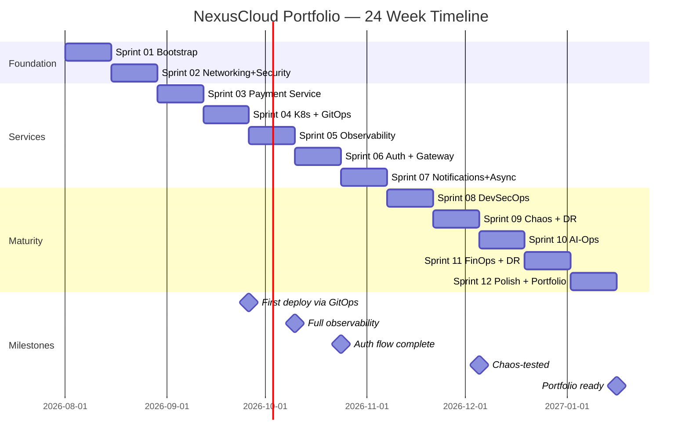

# 05 · Project Structure & Timeline

> **Objetivo:** definir la estructura completa del monorepo y el plan de ejecución sprint por sprint (12 sprints de 2 semanas = 24 semanas / ~6 meses).

---

## 📁 1. Monorepo Structure

```
nexuscloud-portfolio/
│
├── README.md                              # Elevator pitch, badges, quickstart
├── CONTRIBUTING.md                        # How to contribute (simula equipo)
├── CODE_OF_CONDUCT.md                     # Blameless culture
├── LICENSE                                # MIT or Apache 2.0
├── SECURITY.md                            # Vuln disclosure policy
├── CHANGELOG.md                           # Semver + Conventional Commits
├── .editorconfig
├── .gitignore
├── .gitattributes
├── .pre-commit-config.yaml
├── Makefile                               # `make lab-up`, `make test`, etc.
│
├── docs/
│   ├── architecture/
│   │   ├── overview.md                    # High-level narrative
│   │   ├── diagrams/                      # .drawio + exported .png
│   │   │   ├── 01-system-context.drawio
│   │   │   ├── 02-container-diagram.drawio
│   │   │   ├── 03-payment-service-component.drawio
│   │   │   ├── 04-network-topology.drawio
│   │   │   ├── 05-data-flow-payment.drawio
│   │   │   ├── 06-dr-failover.drawio
│   │   │   ├── 07-cicd-pipeline.drawio
│   │   │   ├── 08-threat-model.drawio
│   │   │   ├── 09-observability-plane.drawio
│   │   │   └── exports/                   # PNGs for README embedding
│   │   └── well-architected-review.md
│   │
│   ├── adr/                               # Architecture Decision Records
│   │   ├── 0000-template.md
│   │   ├── 0001-record-architecture-decisions.md
│   │   ├── 0002-opentofu-vs-terraform.md
│   │   ├── 0003-multi-account-aws-strategy.md
│   │   ├── 0004-eks-automode-vs-manual-karpenter.md
│   │   ├── 0005-argocd-as-gitops-engine.md
│   │   ├── 0006-observability-stack-otel-grafana.md
│   │   ├── 0007-ai-assisted-development-workflow.md
│   │   ├── 0008-llm-abstraction-for-ai-ops.md
│   │   ├── 0009-transactional-outbox-pattern.md
│   │   ├── 0010-cloud-to-local-equivalence.md
│   │   ├── 0011-python-fastapi-over-java-spring.md
│   │   └── 0012-trunk-based-development.md
│   │
│   ├── runbooks/                          # Operational procedures
│   │   ├── 00-index.md
│   │   ├── incident-response.md
│   │   ├── dr-failover-playbook.md
│   │   ├── db-connection-exhaustion.md
│   │   ├── chaos-latency-game-day.md
│   │   ├── karpenter-node-issues.md
│   │   ├── argocd-out-of-sync.md
│   │   ├── secrets-rotation.md
│   │   └── finops-review.md
│   │
│   ├── post-mortems/                      # Blameless retrospectives
│   │   ├── 00-template.md
│   │   └── 2026-08-11-INC-1024-db-pool-exhaustion.md
│   │
│   ├── security-model.md                  # STRIDE threat model
│   ├── slo-sli.md                         # Service Level Indicators/Objectives
│   ├── data-classification.md             # Data sensitivity levels
│   │
│   ├── sprints/                           # Sprint plannings + retros
│   │   ├── sprint-01-planning.md
│   │   ├── sprint-01-retro.md
│   │   ├── ... (through sprint-12)
│   │
│   ├── meetings/                          # CAB, tech reviews
│   │   ├── cab/
│   │   │   ├── 2026-08-05-cab-eks-migration.md
│   │   │   └── ...
│   │   └── tech-reviews/
│   │
│   └── portfolio/                         # Portfolio-specific artifacts
│       ├── screenshots/                   # For README, LinkedIn
│       ├── demo-video-script.md
│       └── case-studies/
│
├── infra/                                 # Infrastructure as Code (OpenTofu)
│   ├── README.md
│   ├── backend.tf                         # Remote state (S3+DDB local via LocalStack)
│   ├── providers.tf                       # Multi-region aliased
│   ├── variables.tf
│   ├── outputs.tf
│   │
│   ├── environments/
│   │   ├── dev/
│   │   │   ├── main.tf
│   │   │   ├── terraform.tfvars
│   │   │   └── backend.hcl
│   │   ├── prod/                          # Primary region
│   │   │   └── ...
│   │   └── dr/                            # DR region
│   │       └── ...
│   │
│   └── modules/
│       ├── networking/                    # VPC, subnets, NAT, endpoints
│       │   ├── main.tf
│       │   ├── variables.tf
│       │   ├── outputs.tf
│       │   └── README.md
│       ├── security-baseline/             # IAM, KMS, CloudTrail, GuardDuty
│       ├── eks/                           # EKS cluster or EKS Auto Mode
│       ├── data-layer/                    # RDS/Aurora, DynamoDB, ElastiCache
│       ├── messaging/                     # SQS, SNS, EventBridge
│       ├── storage/                       # S3 buckets
│       ├── edge/                          # CloudFront, WAF, Route53, ACM
│       └── observability/                 # Managed Grafana, Managed Prometheus
│
├── kubernetes/                            # GitOps source of truth
│   ├── README.md
│   ├── kind-config.yaml                   # Local cluster definition
│   │
│   ├── argocd/                            # ArgoCD bootstrap + apps
│   │   ├── install/
│   │   ├── projects/
│   │   │   ├── platform.yaml
│   │   │   └── apps.yaml
│   │   └── applicationsets/
│   │       ├── platform-appset.yaml
│   │       └── apps-appset.yaml
│   │
│   ├── platform/                          # Cluster-level components
│   │   ├── external-secrets/
│   │   ├── external-dns/
│   │   ├── cert-manager/
│   │   ├── ingress-nginx/
│   │   ├── prometheus-stack/
│   │   └── otel-collector/
│   │
│   └── apps/                              # Business apps (Helm charts)
│       ├── payment-service/
│       │   ├── Chart.yaml
│       │   ├── values.yaml
│       │   ├── values-dev.yaml
│       │   ├── values-prod.yaml
│       │   └── templates/
│       │       ├── deployment.yaml
│       │       ├── service.yaml
│       │       ├── ingress.yaml
│       │       ├── hpa.yaml
│       │       ├── pdb.yaml
│       │       ├── networkpolicy.yaml
│       │       ├── configmap.yaml
│       │       └── externalsecret.yaml
│       ├── auth-service/
│       ├── notification-service/
│       ├── ai-ops-agent/
│       └── api-gateway/
│
├── services/                              # Application source code (Python)
│   ├── shared/                            # Common library (published as internal package)
│   │   ├── pyproject.toml
│   │   └── src/nexuscloud_shared/
│   │       ├── __init__.py
│   │       ├── logging.py                 # structlog config
│   │       ├── telemetry.py               # OTel setup
│   │       ├── errors.py                  # Common exceptions
│   │       ├── middleware.py              # Correlation ID, auth
│   │       └── llm_client.py              # AI-Ops abstraction
│   │
│   ├── api-gateway/                       # Ingress orchestration
│   │   ├── pyproject.toml
│   │   ├── Dockerfile
│   │   ├── src/api_gateway/
│   │   └── tests/
│   │
│   ├── auth-service/                      # JWT issuance, verification
│   │   ├── pyproject.toml
│   │   ├── Dockerfile
│   │   ├── src/auth_service/
│   │   └── tests/
│   │
│   ├── payment-service/                   # Core business logic (main app)
│   │   ├── pyproject.toml
│   │   ├── Dockerfile
│   │   ├── src/payment_service/
│   │   │   ├── __init__.py
│   │   │   ├── main.py                    # FastAPI entrypoint
│   │   │   ├── config.py                  # Pydantic settings
│   │   │   ├── api/                       # HTTP routes (adapters/inbound)
│   │   │   ├── application/               # Use cases (application services)
│   │   │   ├── domain/                    # Entities, value objects, rules
│   │   │   ├── infrastructure/            # DB, MQ, external APIs (adapters/outbound)
│   │   │   └── middleware/
│   │   └── tests/
│   │       ├── unit/
│   │       ├── integration/
│   │       └── e2e/
│   │
│   ├── notification-service/              # Async worker (SQS consumer)
│   │   └── ...
│   │
│   └── ai-ops-agent/                      # LLM-powered incident triage
│       ├── pyproject.toml
│       ├── Dockerfile
│       ├── src/ai_ops_agent/
│       │   ├── main.py
│       │   ├── llm_analyzer.py
│       │   ├── jira_client.py
│       │   ├── otel_watcher.py
│       │   └── prompts/
│       └── tests/
│
├── tests/                                 # Cross-cutting tests
│   ├── contract/                          # Consumer-driven contracts
│   ├── e2e/                               # Full end-to-end scenarios
│   ├── load/                              # k6 scripts
│   │   ├── payment-baseline.js
│   │   ├── payment-under-chaos.js
│   │   └── rate-limit-verify.js
│   └── chaos/                             # Chaos experiments
│       ├── inject-db-latency.sh
│       ├── kill-random-pod.sh
│       └── network-partition.sh
│
├── .github/
│   ├── CODEOWNERS
│   ├── PULL_REQUEST_TEMPLATE.md
│   ├── ISSUE_TEMPLATE/
│   │   ├── bug_report.md
│   │   ├── feature_request.md
│   │   ├── incident_report.md
│   │   └── change_request.md
│   ├── review-templates/
│   │   ├── security-review.md
│   │   ├── ops-review.md
│   │   └── architecture-review.md
│   └── workflows/
│       ├── python-ci.yml                  # ruff, mypy, pytest per service
│       ├── tofu-plan.yml                  # OpenTofu validate + plan on PR
│       ├── tofu-apply.yml                 # Apply on merge to main
│       ├── security-scan.yml              # Bandit, Trivy, Checkov, tfsec, gitleaks
│       ├── image-build.yml                # Docker build+push (OIDC)
│       ├── helm-lint.yml                  # Helm chart validation
│       ├── e2e-tests.yml                  # Nightly full E2E on kind
│       ├── finops-infracost.yml           # Cost estimate on IaC PRs
│       └── release.yml                    # Semantic release automation
│
├── scripts/
│   ├── git-as.sh                          # Team identity switcher
│   ├── bootstrap-local.sh                 # First-time local setup
│   ├── seed-data.sh                       # Populate DB with test data
│   ├── chaos/                             # Chaos experiment triggers
│   └── ci/                                # CI helper scripts
│
├── docker/
│   ├── docker-compose.yml                 # Complete local lab
│   ├── otel-collector-config.yaml
│   ├── prometheus.yml
│   ├── tempo.yaml
│   ├── loki-config.yaml
│   ├── grafana/
│   │   ├── provisioning/
│   │   │   ├── datasources/
│   │   │   └── dashboards/
│   │   └── dashboards/
│   └── keycloak/
│       └── realm-export.json
│
└── config/                                # Environment configs
    ├── local.env
    ├── dev.env
    └── prod.env.template
```

---

## 📅 2. Timeline: 12 Sprints × 2 Weeks = 24 Weeks

Cada sprint dura 2 semanas y produce artefactos concretos revisables. Al final de cada sprint hay una **retro documentada** en `/docs/sprints/`.

### Sprint velocity target
- ~15-20 hours/week per person (you playing 4 roles = 15-20 hours total, that's the point of solo work)
- 5-8 story points per sprint (~1 major feature + 2-3 supporting tasks)

---

### **SPRINT 01 — Bootstrap & Foundations** (Weeks 1-2)

**Sprint Goal:** repo initialized, local lab operational, first ADR written.

**Lead:** A-LEAD

**Deliverables:**
- [ ] GitHub repo created with branch protection, labels, templates
- [ ] `docker-compose.yml` con LocalStack + Postgres + Redis + Grafana stack up
- [ ] `Makefile` con `lab-up`, `lab-down`, `k8s-up`, `k8s-down`, `destroy`
- [ ] `git-as.sh` funcionando, README documenta el equipo
- [ ] ADR-0001: Record decisions in ADRs
- [ ] ADR-0002: OpenTofu vs Terraform
- [ ] ADR-0011: Python + FastAPI over Java + Spring
- [ ] ADR-0012: Trunk-based development
- [ ] First diagram: system context (Excalidraw)
- [ ] Pre-commit hooks: ruff, mypy, gitleaks
- [ ] Initial pyproject.toml for shared library

**Definition of Done:** `make lab-up` funciona en máquina limpia y responde `curl http://localhost:4566/_localstack/health`.

**Team activities:**
- A-LEAD: repo setup, ADRs, high-level diagram
- B-DEV: shared library skeleton, pre-commit config
- C-SEC: security policy, `.gitleaks.toml`
- D-OPS: docker-compose, Makefile, first Grafana provisioning

---

### **SPRINT 02 — Networking & Security Baseline** (Weeks 3-4)

**Sprint Goal:** IaC foundation with VPC, IAM, KMS in place (LocalStack simulated).

**Lead:** A-LEAD (infra) + C-SEC (security review)

**Deliverables:**
- [ ] OpenTofu module: `networking` (VPC, subnets, NAT, endpoints)
- [ ] OpenTofu module: `security-baseline` (IAM baseline, KMS keys, S3 policies)
- [ ] `tofu-plan.yml` GitHub Actions workflow
- [ ] Diagram: network topology (draw.io)
- [ ] ADR-0003: Multi-account AWS strategy
- [ ] `docs/security-model.md` initial STRIDE model
- [ ] Backend remoto (S3 + DynamoDB lock) en LocalStack
- [ ] Sprint retro documented

**Definition of Done:** `cd infra/environments/dev && tofulocal apply -auto-approve` succeeds. `tofu output` shows VPC ID and subnets.

**Team activities:**
- A-LEAD: networking + security modules
- C-SEC: STRIDE threat model draft, PR review
- D-OPS: backend remote state setup
- B-DEV: prepare service skeletons

---

### **SPRINT 03 — First Microservice: payment-service (skeleton)** (Weeks 5-6)

**Sprint Goal:** payment-service running locally with FastAPI, clean architecture, DB integration.

**Lead:** B-DEV

**Deliverables:**
- [ ] `payment-service` FastAPI app with clean architecture layout
- [ ] Health endpoints (`/health/live`, `/health/ready`)
- [ ] Structured logging (structlog JSON, correlation IDs)
- [ ] Pydantic v2 request/response models
- [ ] asyncpg + repository pattern for Postgres
- [ ] Unit tests + integration tests (>60% coverage this sprint)
- [ ] Multi-stage Dockerfile (distroless, non-root)
- [ ] Local Docker image builds successfully
- [ ] ADR-0009: Transactional Outbox pattern

**Definition of Done:** `docker compose up payment-service` responds `200` on `/health/ready` and `POST /v1/payments` inserts to DB.

---

### **SPRINT 04 — Kubernetes Local & Helm Charts** (Weeks 7-8)

**Sprint Goal:** kind cluster with ArgoCD + payment-service deployed via Helm + GitOps.

**Lead:** A-LEAD + D-OPS

**Deliverables:**
- [ ] `kind-config.yaml` con multi-node local cluster
- [ ] ArgoCD installed and accessible on localhost
- [ ] Helm chart for payment-service (Deployment, Service, HPA, PDB, NetworkPolicy)
- [ ] ApplicationSet configured to sync from `kubernetes/apps/`
- [ ] ADR-0005: ArgoCD as GitOps engine
- [ ] Runbook: "ArgoCD out of sync — troubleshooting"

**Definition of Done:** `git push` a `main` triggers ArgoCD sync → new version live in kind < 3 min. Verified via `kubectl` + video capture.

---

### **SPRINT 05 — Observability Stack** (Weeks 9-10)

**Sprint Goal:** end-to-end observability: logs + metrics + traces + dashboards + alerts.

**Lead:** D-OPS

**Deliverables:**
- [ ] OTel Collector as DaemonSet in kind
- [ ] payment-service instrumented (traces, metrics, logs)
- [ ] Prometheus + Loki + Tempo in cluster
- [ ] Grafana with 3 dashboards (RED metrics, USE metrics, business KPIs)
- [ ] Alert rules for SLO violations
- [ ] `docs/slo-sli.md` defined with numbers
- [ ] ADR-0006: Observability stack decision
- [ ] Grafana dashboards as code (provisioning)

**Definition of Done:** Grafana muestra P95 latency, error rate, and Tempo shows distributed traces con correlation IDs consistentes end-to-end.

---

### **SPRINT 06 — Auth Service & API Gateway** (Weeks 11-12)

**Sprint Goal:** JWT-based auth flow via Keycloak (Cognito local substitute).

**Lead:** B-DEV + C-SEC

**Deliverables:**
- [ ] Keycloak configured with realm `nexuscloud`, client, roles
- [ ] `auth-service` (Python): issue/verify JWTs, refresh tokens
- [ ] API Gateway service: validates JWT, forwards with correlation ID
- [ ] Payment endpoints require valid JWT
- [ ] Rate limiting middleware (Redis sliding window)
- [ ] Security review: PR-based STRIDE analysis by C-SEC
- [ ] SBOM generation in CI (syft)

**Definition of Done:** curl con JWT válido pasa; sin JWT retorna 401; rate limit enforced con 429.

---

### **SPRINT 07 — Notification Service & Async Processing** (Weeks 13-14)

**Sprint Goal:** async event-driven processing via SQS with DLQ.

**Lead:** B-DEV

**Deliverables:**
- [ ] `notification-service` (async worker) consumes SQS
- [ ] Outbox pattern implemented in payment-service (guaranteed at-least-once)
- [ ] SQS DLQ configured (maxReceiveCount=3)
- [ ] Poison pill handling with proper error routing to DLQ
- [ ] MailHog integration (email preview)
- [ ] Diagram: sequence — payment happy path (Mermaid in README)
- [ ] Integration tests covering SQS end-to-end

**Definition of Done:** POST /v1/payments → outbox → SQS → notification-service → MailHog email visible.

---

### **SPRINT 08 — DevSecOps Pipeline Maturity** (Weeks 15-16)

**Sprint Goal:** production-grade CI/CD with shift-left security.

**Lead:** C-SEC + A-LEAD

**Deliverables:**
- [ ] `security-scan.yml` complete: Bandit, Trivy, Checkov, tfsec, gitleaks, pip-audit
- [ ] All scans fail on HIGH/CRITICAL
- [ ] OIDC federation to AWS documented (working in "vitrina mode")
- [ ] Image signing with cosign (optional but pro)
- [ ] SBOM attached to releases
- [ ] Dependabot / Renovate config
- [ ] Post-mortem template written
- [ ] Threat model reviewed and expanded

**Definition of Done:** deliberately introduce a vulnerable dep → PR fails → docs explain remediation.

---

### **SPRINT 09 — Chaos Engineering & DR** (Weeks 17-18)

**Sprint Goal:** validated resilience through chaos experiments.

**Lead:** D-OPS

**Deliverables:**
- [ ] Toxiproxy integrated in docker-compose
- [ ] chaos-mesh installed on kind
- [ ] 3 chaos experiments run + documented:
  - Network latency injection
  - Pod kill during traffic
  - DB primary failure with failover script
- [ ] Runbook: DR failover with cronometrized RTO/RPO
- [ ] Circuit breakers in payment-service (tenacity)
- [ ] 1 simulated incident + post-mortem written (blameless)
- [ ] Game day video (5 min)

**Definition of Done:** video demo shows failover exitoso; post-mortem publicado en `/docs/post-mortems/`.

---

### **SPRINT 10 — AI-Ops Agent** (Weeks 19-20)

**Sprint Goal:** LLM-powered incident detection and Jira ticket creation.

**Lead:** B-DEV + A-LEAD

**Deliverables:**
- [ ] `ai-ops-agent` service with `LLMClient` abstraction
- [ ] Implementations: Ollama (default), Bedrock (documented, config-swappable), Groq (fallback)
- [ ] OTel exception watcher: streams error traces to agent
- [ ] Agent generates ITIL v4-styled diagnosis + creates Jira ticket via REST API
- [ ] Jira Cloud Free instance configured with realistic issue types
- [ ] ADR-0007: AI-assisted development workflow
- [ ] ADR-0008: LLM abstraction design

**Definition of Done:** trigger exception → 60 sec later, Jira ticket appears with correlation ID, timeline, and suggested remediation.

---

### **SPRINT 11 — FinOps & Multi-Region Simulation** (Weeks 21-22)

**Sprint Goal:** cost awareness in CI and DR region documented.

**Lead:** A-LEAD + D-OPS

**Deliverables:**
- [ ] Infracost integrated in PR workflow (cost delta comment)
- [ ] Tags policy enforced in OpenTofu (Environment, Owner, Project, CostCenter)
- [ ] "DR region" simulated: second Postgres, S3 replication script
- [ ] Aurora Global DB failover pattern documented
- [ ] Runbook: FinOps monthly review
- [ ] Carbon-aware region selection ADR
- [ ] Green Software metrics documented

**Definition of Done:** PR comment muestra cost delta; DR runbook ejecutable en < 3 min medidos.

---

### **SPRINT 12 — Polish, Documentation & Portfolio** (Weeks 23-24)

**Sprint Goal:** portfolio-ready presentation.

**Lead:** A-LEAD (all hands)

**Deliverables:**
- [ ] README.md pulido con:
  - Elevator pitch
  - Badges (CI, coverage, license)
  - Architecture diagram embedded
  - Quickstart
  - Screenshots
  - Video demo link
- [ ] 3-5 min video demo (OBS Studio + YouTube unlisted)
- [ ] Portfolio site (Cloudflare Pages)
- [ ] Case study writeups (2-3) from ADRs
- [ ] LinkedIn Featured section updated
- [ ] CV finalized
- [ ] All screenshots captured (see `10-portfolio-github-showcase.md`)
- [ ] Optional: 2 semanas AWS real ($50-80) for "vitrina" evidence

**Definition of Done:** un amigo técnico revisa el repo en 10 min y entiende la arquitectura sin explicaciones tuyas.

---

## 📊 3. Timeline Gantt (Mermaid)

Este diagrama va en el README:

````markdown

````

---

## 🎯 4. Sprint ceremonies (simulated solo)

Even working alone, do these — the artifacts are evidence of process maturity:

### 4.1 Sprint Planning (Day 1 of sprint, 30-45 min)
- Review backlog en Jira
- Commit stories to sprint (5-8 pts)
- Update `docs/sprints/sprint-NN-planning.md`
- Assign primary owner per role

### 4.2 Daily standup (5 min mental, or written)
- Actually skip this solo — instead write 1 sentence in a `docs/sprints/daily-log.md` at end of each work day.

### 4.3 Sprint Review (Day 14 of sprint, 30 min)
- Demo what shipped (screenshots or short video)
- Update ticket statuses

### 4.4 Sprint Retro (Day 14 of sprint, 30 min)
- What went well?
- What didn't?
- Action items (concrete, owned, dated)
- Update `docs/sprints/sprint-NN-retro.md`

### 4.5 Backlog Refinement (mid-sprint, 15 min)
- Review next 5-10 backlog tickets
- Add acceptance criteria
- Estimate

---

## 📌 5. Milestones & sanity checks

**End of Sprint 04 (Week 8):** primer deploy vía GitOps funciona. Si no lo tienes, algo está mal — revisa el approach.

**End of Sprint 06 (Week 12):** puedes rendir SAA (Solutions Architect Associate). Deberías haberlo agendado.

**End of Sprint 09 (Week 18):** proyecto tiene "cuerpo" — puedes empezar a linkearlo en LinkedIn.

**End of Sprint 12 (Week 24):** portfolio completo, listo para postular seriamente.

---

## 🔗 6. Cross-references

- Contenidos técnicos por sprint → `08-microservices-code-blueprints.md`
- Cómo se llenan los tickets Jira de cada sprint → `06-jira-itil-v4-workflows.md`
- Cómo mostrar el resultado en LinkedIn → `10-portfolio-github-showcase.md`

---

*Project Structure & Timeline · v1.0*
